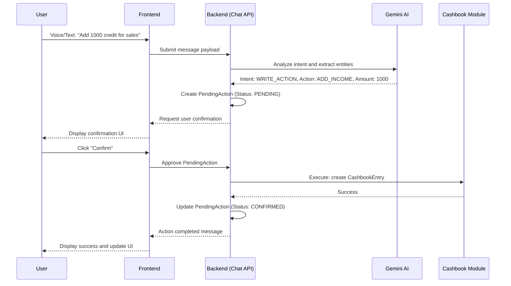

# AIBMS - Project Documentation

## 1. Project Overview
AIBMS is an advanced, AI-driven Business Management System engineered to revolutionize how multi-branch businesses handle accounting, document intelligence, and day-to-day operations. It combines traditional ERP features with next-generation generative AI, featuring a digital Cashbook, automated invoice processing, and a highly capable Conversational AI Assistant.

## 2. Technology Stack

### Frontend
- **Framework**: React 18, Vite
- **Routing**: React Router v7
- **Styling**: Tailwind CSS v4, Emotion, Radix UI components
- **Animations**: Framer Motion
- **Charts/Data Visualization**: Recharts
- **State Management**: React Hooks Context, Local Storage

### Backend
- **Framework**: Django 4.2.11, Django REST Framework (DRF)
- **Database**: PostgreSQL (`psycopg2-binary`)
- **Authentication**: JWT (JSON Web Tokens) via `djangorestframework-simplejwt`
- **Asynchronous Task Queue**: Celery with Redis broker
- **Cloud Storage**: AWS S3 (`boto3`, `django-storages`)
- **Document Processing**: `PyPDF2`, `Pillow`, `openpyxl`

### AI & External Services
- **Generative AI**: Google Gemini API (`gemini-2.5-flash`) used for natural language understanding, transaction parsing, and general knowledge querying.
- **Voice-to-Text**: AssemblyAI for real-time transcription of voice commands.
- **Text-to-Speech**: Murf AI for rendering natural-sounding voice responses from the chatbot.

---

## 3. Core Modules & Functionality

The AIBMS platform is broken down into several tightly integrated modules, each designed to handle a specific operational domain.

### 3.1. Business & Branch Management
AIBMS inherently supports multi-business owners and complex, hierarchical branch structures.

**Business Module (`business`):**
- Supports various business categories (Retail, Manufacturing, Healthcare, etc.).
- Stores essential compliance data (GSTIN, PAN, TAN).
- Configurable settings at the business level (`BusinessSettings`) to toggle modules on/off (e.g., `enable_cashbook`, `enable_documents`).

**Branch Module (`branches`):**
- Supports varied branch types: Head Office, Branch, Warehouse, Outlet, and Franchise.
- **Same-City Disambiguation**: Employs a `locality` field to distinguish between multiple branches located within the same city.
- **Operating Hours**: Granular tracking of opening/closing times for each day of the week.
- **Branch Isolation**: Data is partitioned so that transactions, documents, and reports can be strictly filtered based on the branch.

### 3.2. Digital Cashbook
The `cashbook` module replaces traditional ledgers with an intelligent, multi-branch tracking system.

**Key Features:**
- **Transactions**: Tracks Credit (Money In) and Debit (Money Out) with comprehensive categorization.
- **Payment Modes**: Cash, UPI, Bank Transfer, Cheque, Card.
- **Receivables & Payables Lifecycle**: Transactions are logged with a `date` (expected due date) and a `settlement_date` (actual date the money moved). This ensures accurate cash flow forecasting.
- **Daily Summaries**: The `DailyCashSummary` aggregates daily credit, debit, opening balances, and closing balances per branch and per business.

### 3.3. Document Intelligence
The `documents` module provides an AI-augmented cloud storage solution for business files.

**Key Features:**
- **Hierarchical Storage**: Documents can be organized into nested `DocumentFolders`.
- **Categorization & Expiry**: Supports categories like Invoices, Receipts, Contracts, and Licences. Documents can have an `expiry_date` (useful for tracking expiring contracts or licences).
- **Secure Sharing**: Documents can be shared internally with other users (`DocumentShare`), granting either `VIEW` or `DOWNLOAD` access, with an optional expiration timestamp.
- **Audit Trails**: Every interaction (view, download, share, update) is logged via `DocumentActivityLog`.
- **AI Parsing**: When invoices or receipts are uploaded, the AI extracts the vendor, amount, date, and category. An intermediate verification modal is presented to the user to confirm the extracted data before pushing the entry directly to the Cashbook.

### 3.4. Conversational AI Chatbot (CA Assistant)
The `ai_chatbot` module is the intelligent core of AIBMS, capable of executing actions and providing specialized knowledge.

**Key Features:**
- **Multi-Modal Intents**: The chatbot parses user input to determine the `ChatIntent`, which includes:
  - `KNOWLEDGE_QUERY`: Standard accounting queries.
  - `DATA_QUERY`: Asking for specific Cashbook data.
  - `WRITE_ACTION`: Commands like "Log 500 payable for office supplies."
- **Specialized Knowledge Base**: The AI is grounded by a custom `KnowledgeBase` segmented into domains like Accounting Standards, Corporate Laws, and ICAI Guidelines.
- **Action Execution Flow**: 
  - When the AI detects a `WRITE_ACTION`, it creates a `PendingAction` (e.g., `ADD_INCOME`, `ADD_EXPENSE`).
  - The frontend prompts the user to confirm the action.
  - Once confirmed, the system executes the backend logic, effectively allowing users to manage their business entirely through natural language.
- **Voice Integration**: Users can speak to the assistant (AssemblyAI STT). The assistant can reply with natural voice responses (Murf AI TTS).
- **Usage Analytics**: Tracks tokens, message counts, and query types via `ChatbotUsageStats`.

---

## 4. System Architecture

The architecture relies on a decoupled client-server model. The frontend (React) communicates with the backend (Django) via RESTful APIs secured with JWT.

### AI Action Execution Lifecycle (Mermaid Diagram)



---

## 5. Setup & Installation

### 5.1. Backend Setup
1. Navigate to the `backend` directory.
2. Create and activate a virtual environment:
   ```bash
   python -m venv venv
   source venv/Scripts/activate  # On Windows
   # source venv/bin/activate    # On Mac/Linux
   ```
3. Install dependencies:
   ```bash
   pip install -r requirements.txt
   ```
4. Configure `.env` file with Database credentials, AWS S3 keys, Celery/Redis URLs, Gemini API Key, AssemblyAI Key, and Murf API Key.
5. Apply migrations and start the Celery worker and the Django server:
   ```bash
   python manage.py migrate
   celery -A config worker -l info
   python manage.py runserver
   ```

### 5.2. Frontend Setup
1. Navigate to the `frontend` directory.
2. Install Node.js dependencies:
   ```bash
   npm install
   ```
3. Start the Vite development server:
   ```bash
   npm run dev
   ```
