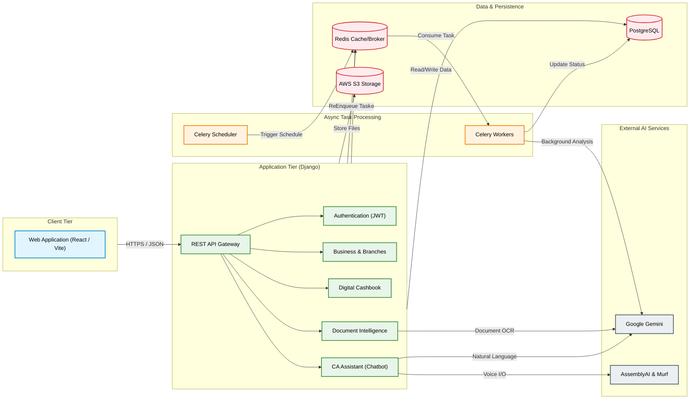

# AIBMS - System Architecture

This document provides a comprehensive overview of the AIBMS system architecture, illustrating the interactions between the client layer, backend application services, asynchronous workers, data storage, and external AI integrations.

## Architecture Diagram

## Component Breakdown

### 1. Client Tier
- **React/Vite SPA**: The frontend application built with React 18 and Vite. It handles complex UI states (Dashboards, Chat interfaces) and securely stores the JWT in local storage.

### 2. API Gateway
- **NGINX**: Serves as the reverse proxy and load balancer. It handles SSL termination, static file serving (if required), and routes incoming RESTful API requests to the Django backend.

### 3. Application Tier (Django Backend)
- **Django REST Framework (DRF)**: The core API engine handling all incoming requests, validating data, and returning JSON responses.
- **JWT Authentication**: Secures endpoints and enforces Role-Based Access Control logic (e.g., verifying if a user is an Owner vs. Staff).
- **Core Modules**: Independent, decoupled Django apps (Business, Cashbook, Documents, Chatbot) that contain the specific business logic for AIBMS.

### 4. Asynchronous Task Processing
- **Celery & Redis**: For heavy, time-consuming operations (e.g., AI document parsing, batch data processing), the backend offloads tasks to Celery workers. Redis acts as both the message broker to queue these tasks and a caching layer to speed up recurring database queries.

### 5. Data & Persistence Tier
- **PostgreSQL**: The primary relational database ensuring ACID compliance for critical financial ledgers and user data.
- **AWS S3**: Cloud object storage handling the persistence of uploaded invoices, receipts, and system-generated audio files (Murf AI responses).

### 6. External AI Services
- **Google Gemini**: The generative AI backbone responsible for interpreting natural language intents, answering knowledge queries, and extracting structured financial data from uploaded documents.
- **AssemblyAI**: Converts user audio streams into text for the chatbot.
- **Murf AI**: Generates natural, conversational audio responses from the chatbot's text replies.
